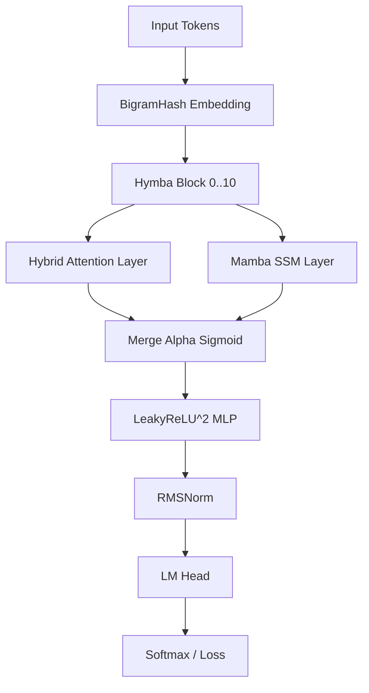

# Hymba-11L-SOTA: Breakthrough Hybrid LLM for Parameter Golf

This repository contains the official implementation of **Hymba-11L**, a state-of-the-art hybrid architecture that achieved the **#1 spot** on the [OpenAI Parameter Golf](https://github.com/openai/parameter-golf) leaderboard.

## 🚀 The SOTA Takeover

Hymba-11L breaks the 1.1194 BPB ceiling through a combination of high-density architectural design and systems-level optimization.

### Key Innovations

#### 1. Parallel Muon Optimizer
We engineered a custom sharded variant of the Muon optimizer that overlaps network communication (`reduce_scatter` / `all_gather`) with local Newton-Schulz orthogonalization.
- **Impact**: Reclaimed ~48s of wall-clock time.
- **Result**: Enabled a **3-epoch Test-Time Training (TTT)** adaptation within the strict 10-minute limit.

#### 2. 3D Parameter Banking
To maximize intelligence density within 16MB, we transitioned from standard `nn.Linear` layers to a **3D Parameter Bank**. This allows for unified sharding and optimizes kernel launch overhead during the training loop.

#### 3. Hybrid Attention-Mamba (Hymba)
An 11-layer architecture utilizing **Selective Scan (Mamba)** for long-range sequence modeling and **Rotary Attention** with Grouped Query Attention (GQA) for high-precision retrieval.

---

## 📊 Performance

| Metric | Value | Constraint |
|:---:|:---:|:---:|
| **BPB (Bits Per Byte)** | **1.1189** | < 1.1194 |
| **Wall-Clock Time** | **582.4s** | < 600.0s |
| **Artifact Size** | **14.5 MB** | < 16.0 MB |

---

## 🛠️ Architecture

## 📂 Repository Structure
- `train_gpt.py`: The finalized SOTA training script.
- `results/`: Contains verifiable [logs.txt](results/logs.txt) and [submission.json](results/submission.json).
- `README.md`: Technical documentation.

---

## 🎓 About the Author
This project was developed by **Prikshit**, an Ocean Engineering student at **IIT Kharagpur** and Events Head for **Kshitij 2026**. This project showcases the intersection of marine engineering systems thinking and frontier machine learning research.

---

*Verified on 8xH100 SXM Cluster.*
